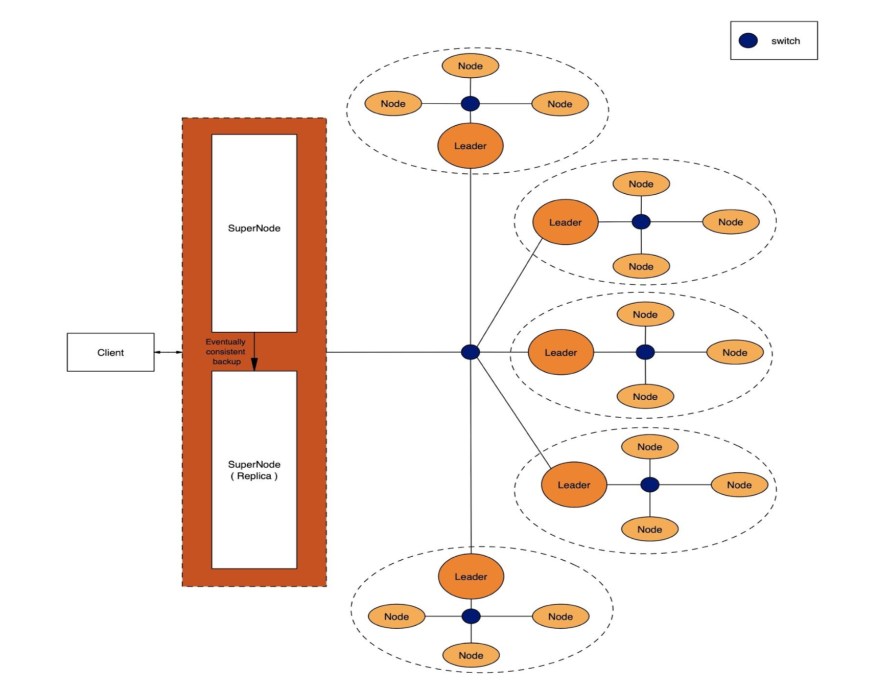

# Distributed File Storage

This project presents an open-source, scalable, and robust distributed storage solution. It enables multiple servers to collaborate, forming a dynamic 'overlay' network.
Key features include:

- Platform independence
- Fault tolerance and recovery
- Adaptive task distribution
- Extensibility
- Resilience
- Concurrent request handling
- Distributed consensus (RAFT)
- Data redundancy
- Enhanced caching
- Optimized search functionality

##### Supported user services (expandable): - 

    1. File Upload (all formats)
    2. File Download
    3. File Search
    4. File Listing (user-specific)
    5. File Deletion
    6. File Modification

The system facilitates multi-client data access and supports CRUD operations. Files are segmented into chunks, distributed across remote machines for parallel processing.

****************************************************************************************************************


### Architecture Diagram



****************************************************************************************************************

### Technology Stack


****************************************************************************************************************

### Setup Instructions
- Install dependencies from requirements.txt
- Configure server IPs and parameters in config.yaml
- Update iptable.txt with cluster IPs

#### Launch Supernode
```
python3 supernode.py
```

#### Launch Cluster Nodes

```
python3 server.py four
```
```
python3 server.py five
```
```
python3 server.py six
```

#### Launch Client
```
python3 client.py
```
